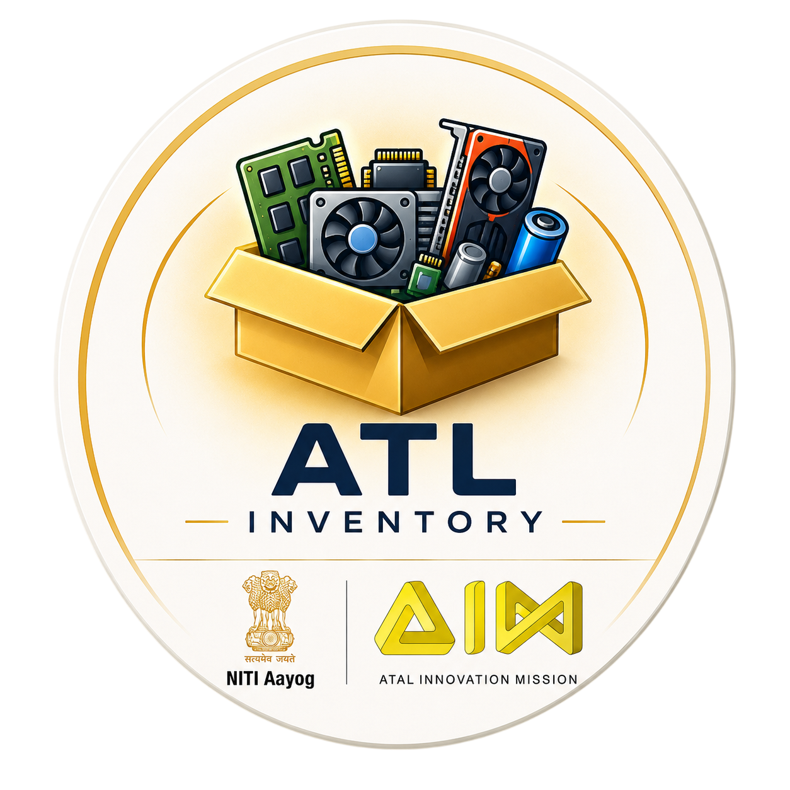

# 🚀 ATL Inventory

<div align="center">



### Smart Inventory Management for ATL Labs

A modern Flutter-based inventory management application designed for ATL (Atal Tinkering Lab) environments to efficiently organize, manage, and track electronic components with both offline and cloud synchronization support.


</div>

---

# ✨ Features

## 📦 Inventory Management
- Add electronic components
- Edit existing component details
- Delete inventory items
- Track stock availability
- Organize components using box numbers

---

## 📷 Image Support
- Capture component images using camera
- Select images from gallery
- Cloud image synchronization
- Default placeholder image support

---

## ☁️ Offline + Online Sync
- Works completely offline
- SQLite local database
- Automatic Supabase synchronization
- Multi-device inventory sync
- Real-time sync status indicator

---

## 🔍 Smart Search
- Search using:
  - Component name
  - Box number
  - QR codes

---

## 🎨 Modern UI
- Dark & Light mode
- Responsive card-based layout
- Smooth rounded modern design
- Premium inventory card styling
- Edit mode protection

---

# 📱 Application Screenshots

---

## 🏠 Home Screen

> Displays all available components in a beautiful grid layout.

<p align="center">
  
  
</p>

### Features Visible
- Search bar
- Sync indicator
- QR scanner
- Edit mode
- Component cards
- Floating add button

---

## ➕ Add Component Screen

> Add new components with details and images.

<p align="center">
  
</p>

### Includes
- Component details
- Availability management
- Camera upload
- Gallery upload
- Cloud sync

---

## 🔐 Edit Mode

> Secure inventory modification system protected using password authentication.

<p align="center">
  
</p>

---

## 📷 QR Scanner

> Quickly search components using QR codes.

<p align="center">
  
</p>

---

# 🧠 Tech Stack

| Technology | Purpose |
|------------|----------|
| Flutter | Frontend Framework |
| Dart | Programming Language |
| SQLite | Offline Database |
| Supabase | Cloud Backend |
| mobile_scanner | QR Scanner |
| image_picker | Camera/Gallery Access |

---

# 🏗️ Project Structure

```bash
lib/
│
├── assets/
│
├── database/
│   └── database_helper.dart
│
├── screens/
│   ├── inventory_screen.dart
│   ├── add_part_screen.dart
│   └── qr_scanner_screen.dart
│
├── services/
│   └── sync_service.dart
│
├── widgets/
│   ├── component_card.dart
│   ├── search_bar.dart
│   └── add_component_dialog.dart
│
└── main.dart
```

---

# ⚙️ Main Functionalities

## 📦 Inventory Tracking
Track all electronic components available in the ATL lab.

---

## ☁️ Cloud Synchronization
Automatically synchronize inventory data across devices using Supabase.

---

## 💾 Offline Support
Continue using the application even without internet connection.

---

## 🔍 QR-Based Searching
Quickly locate components by scanning QR labels attached to storage boxes.

---

## 📷 Image-Based Component Identification
Store images of components for easier identification and management.

---

# 🎨 UI Design Highlights

- Rounded modern inventory cards
- Dark futuristic interface
- Smooth shadows and glow effects
- Animated splash screen
- Elegant floating action buttons
- Minimal clean typography

---

# 🚀 Future Improvements

- 🤖 AI component recognition
- 📊 Analytics dashboard
- 📄 PDF/Excel export
- 🔔 Low stock alerts
- 👥 Multi-user support
- 📈 Usage statistics
- 🎤 Voice search
- 🏷️ Barcode generation

---

# 🛠️ Installation

## Clone Repository

```bash
git clone https://github.com/your-username/atl_inventory.git
```

---

## Install Dependencies

```bash
flutter pub get
```

---

## Run Application

```bash
flutter run
```

---

# 📌 Requirements

- Flutter SDK
- Android Studio / VS Code
- Android Device or Emulator
- Supabase Project
- Internet connection for cloud sync

---

# 👨‍💻 Developer

## Saibal Bera

MCA Final Year Student  
Passionate about building impactful software solutions using Flutter, AI, and modern technologies.

---

# 📖 Project Purpose

ATL Inventory is designed to help students and teachers efficiently manage electronic components inside ATL Labs by providing a modern, organized, and cloud-synced inventory system.

---

# ⭐ Final Preview

<p align="center">
  
</p>

---

<div align="center">

### 🌟 Built with Flutter & Supabase

</div>
