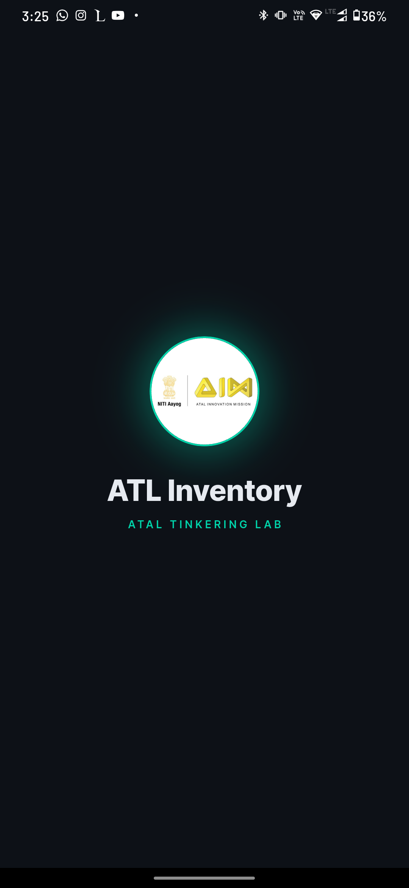
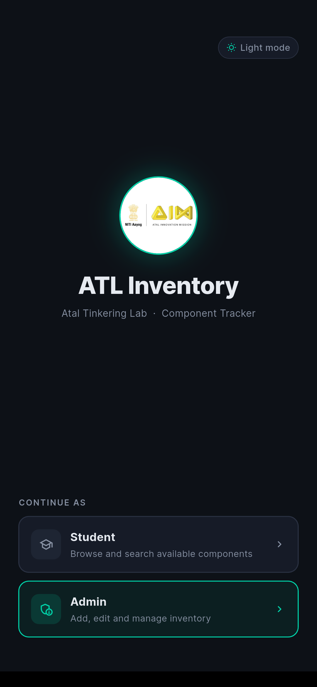
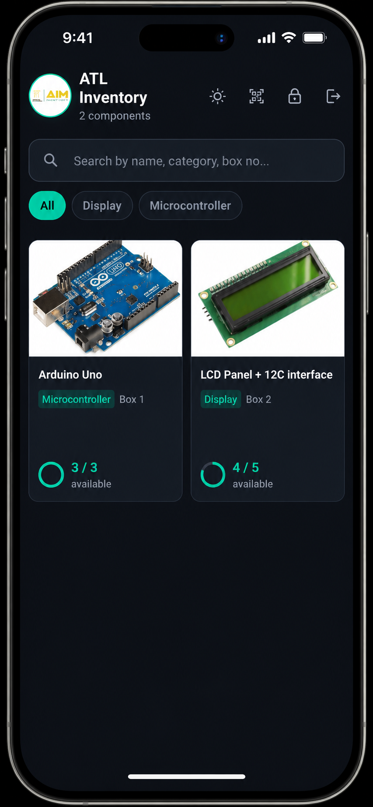
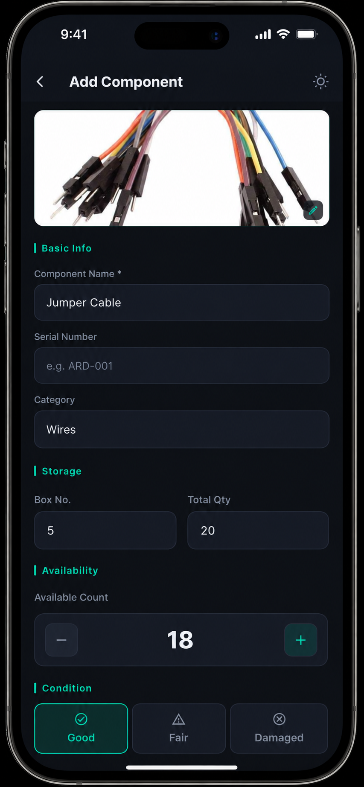

<div align="center">


# ATL Inventory

### Atal Tinkering Lab · Component Tracker


A Flutter app for managing lab components in an Atal Tinkering Lab.  
Students browse in real time. Admins add, edit, and delete — changes reflect instantly on all devices.

[Download APK](#releases) · [Report Bug](../../issues) · [Request Feature](../../issues)

</div>

---

## Screenshots

|   Splash  |   Login   |  Inventory | Add Component |
|-----------|-----------|------------|---------------|
|  |  |  |  |

---

## Features

| Feature | Details |
|---|---|
| **Real-time sync** | Supabase Realtime — admin changes appear on all devices in ~1 second |
| **Role-based access** | Student (read-only) and Admin (password-protected edit) |
| **Component cards** | Image, name, category, box number, availability arc indicator |
| **Category filters** | Tap chips to filter by component type |
| **Search** | Search by name, serial number, category, or box number |
| **QR scanner** | Scan a box QR code to filter components instantly |
| **Image upload** | Admin can attach photos via camera or gallery |
| **Light / Dark mode** | Toggle from any screen |
| **Offline resilient** | Shows last-loaded data if network drops |

---

## Tech Stack

| Layer | Technology |
|---|---|
| Frontend | Flutter (Dart) |
| Database | Supabase (PostgreSQL) |
| Realtime | Supabase Realtime (WebSocket) |
| Storage | Supabase Storage (part images) |
| Fonts | Google Fonts — Inter |
| QR Scanning | `mobile_scanner` |
| Image picking | `image_picker` |

---

## Project Structure

```
lib/
├── main.dart                  # App entry, Supabase init, theme tokens
├── assets/
│   ├── banner.png             # App banner / splash logo
│   ├── logo.jpg               # App logo
│   └── default_part.jpg       # Fallback part image
└── screens/
    ├── splash_screen.dart     # Animated splash with logo
    ├── login_screen.dart      # Role selection (Student / Admin)
    ├── inventory_screen.dart  # Real-time grid, search, category chips
    ├── add_part_screen.dart   # Add / edit component form with image upload
    └── qr_scanner_screen.dart # Box QR code scanner
```

---

## Getting Started

### Prerequisites

- Flutter SDK `>=3.10.4`
- Dart SDK `>=3.10.4`
- Android Studio / VS Code with Flutter extension
- A [Supabase](https://supabase.com) account (free tier is enough)

### 1 — Clone the repo

```bash
git clone https://github.com/YOUR_USERNAME/atl_inventory.git
cd atl_inventory
```

### 2 — Set up Supabase

1. Go to [supabase.com](https://supabase.com) → **New Project**
2. Note your **Project URL** and **anon public key** from `Settings → API`
3. Run this in **SQL Editor**:

```sql
-- Parts table
create table if not exists public.parts (
  id            text        primary key,
  part_name     text        not null,
  serial_no     text        default '',
  category      text        default '',
  box_no        integer     default 0,
  total_parts   integer     default 0,
  availability  integer     default 0,
  image_url     text        default '',
  last_updated  timestamptz default now()
);

alter table public.parts enable row level security;
create policy "Public read"  on public.parts for select using (true);
create policy "Public write" on public.parts for all using (true) with check (true);
alter publication supabase_realtime add table public.parts;

-- Storage bucket
insert into storage.buckets (id, name, public)
values ('part-images', 'part-images', true) on conflict do nothing;

create policy "Public image read"   on storage.objects for select using (bucket_id = 'part-images');
create policy "Public image upload" on storage.objects for insert with check (bucket_id = 'part-images');
create policy "Public image update" on storage.objects for update using (bucket_id = 'part-images');
```

### 3 — Add your credentials

In `lib/main.dart`:

```dart
const kSupabaseUrl     = 'https://YOUR_PROJECT_ID.supabase.co';
const kSupabaseAnonKey = 'YOUR_ANON_KEY';
```

### 4 — Install and run

```bash
flutter pub get
flutter run
```

### 5 — Build APK

```bash
flutter build apk --release
# Output: build/app/outputs/flutter-apk/app-release.apk
```

---

## Admin Access

Default password: `aTal@2026`

To change it, search `aTal@2026` in the codebase and replace it.  
For production, move this to a Supabase Edge Function or environment variable.

---

## Database Schema

```
Table: parts
┌──────────────┬─────────────┬──────────────────────────────────────────┐
│ Column       │ Type        │ Description                              │
├──────────────┼─────────────┼──────────────────────────────────────────┤
│ id           │ text (PK)   │ UUID generated by the app                │
│ part_name    │ text        │ Component name (e.g. Arduino Uno)        │
│ serial_no    │ text        │ Serial / asset number                    │
│ category     │ text        │ Used for filter chips                    │
│ box_no       │ integer     │ Physical storage box number              │
│ total_parts  │ integer     │ Total quantity in lab                    │
│ availability │ integer     │ Currently available count                │
│ image_url    │ text        │ Public URL from Supabase Storage         │
│ last_updated │ timestamptz │ Timestamp of last edit                   │
└──────────────┴─────────────┴──────────────────────────────────────────┘
```

---

## How Realtime Works

```
Admin edits a part on Device A
        │
        ▼
Supabase PostgreSQL (upsert)
        │
        ▼
supabase_realtime broadcasts change
        │
    ┌───┴───┐
    ▼       ▼
Device B  Device C
(UI updates instantly — no refresh needed)
```

---

## Releases

### v1.0.0 — Initial Release
> First stable release of ATL Inventory

**What's new:**
- Real-time component tracking via Supabase
- Student and Admin role-based access
- Component cards with image, category, box number, availability arc
- QR code scanner for instant box filtering
- Image upload via camera or gallery
- Light and Dark mode support
- Animated splash screen and login screen

**Download:** [app-release.apk](../../releases/download/v1.0.0/app-release.apk)

---

## Roadmap

- [ ] Supabase Auth (email login for admins)
- [ ] Low-stock alerts / push notifications
- [ ] Export inventory as CSV / PDF
- [ ] Borrow / return log with student name tracking
- [ ] iOS support and TestFlight build

---

## Contributing

1. Fork the repo
2. Create a branch: `git checkout -b feature/your-feature`
3. Commit: `git commit -m 'Add some feature'`
4. Push: `git push origin feature/your-feature`
5. Open a Pull Request

---

## License

[MIT](LICENSE)

---

<div align="center">
  Built with ❤️ for Atal Tinkering Labs across India
</div>
